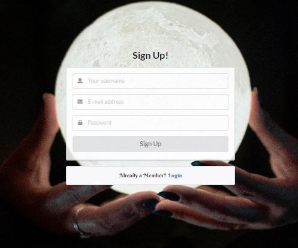
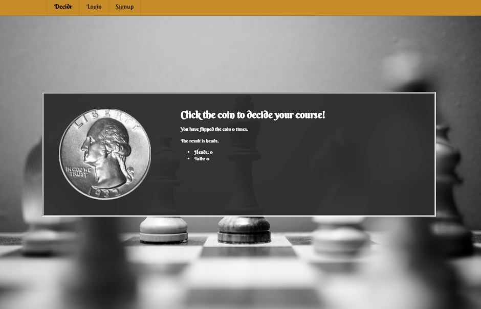
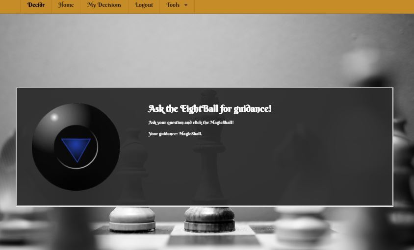

# Decision Maker

<a href=""></a>
<a href=""></a>
<a href=""></a>
## About

Decision Maker is an app that helps users make decisions based on randomized probability instead of having to do it themselves. 


## Technology

This page was built with the following technologies:
```
  JavaScript
  MongoDB
  Mongoose
  Webpack Service Workers
  React
  Node/Express
  GraphQL
  Json Web Tokens
  Contest API
 ```


 ## Contributors
 * [Blake Gale](https://github.com/BG00924)
 * [Kennadee Ray](https://github.com/KRAY306090)
 * [Jena Holtzclaw](https://github.com/jholtzclaw)

## Website


## Release Notes
* Version 1 is an MVP with basic functionality. 

## Screenshots


